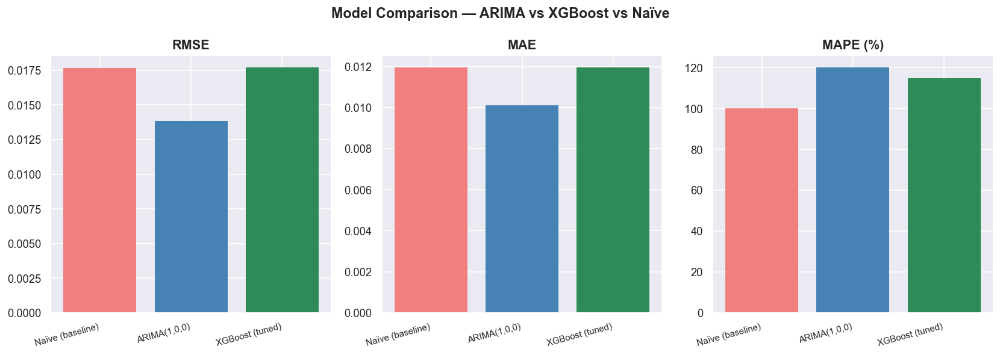
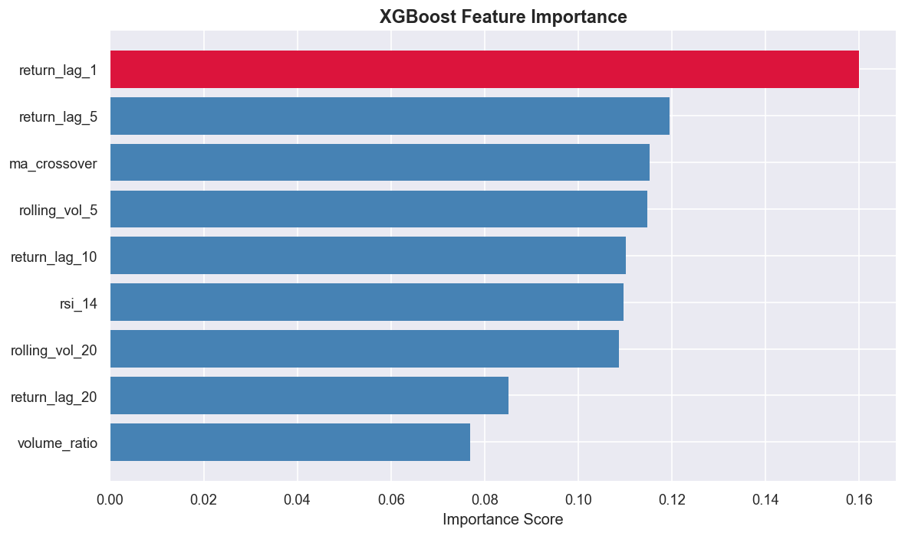

# Stock Return Prediction Pipeline

I built this as a quant research assignment for Invsto. The goal was to predict next-day stock returns across 14 equities using machine learning. Rather than just completing a checklist, I approached this the way you would at an actual fund: honest evaluation, a reproducible pipeline, and findings that mean something.



## What I Found

Neither ARIMA nor XGBoost beat a naive forecast of predicting zero every day. That is not a failure. It is the correct result. Price and volume history alone carries very little signal at a one-day horizon. The more interesting finding is in the feature importance: rolling volatility dominates, meaning the market prices risk more consistently than direction.



## Project Structure

```text
invsto-assignment/
├── data/
│   ├── raw/
│   └── processed/
├── src/
│   ├── ingest.py     # data download from yfinance
│   ├── clean.py      # cleaning and standardization
│   ├── features.py   # feature engineering
│   └── evaluate.py   # evaluation metrics
├── notebooks/
│   ├── 01_data_prep.ipynb
│   ├── 02_eda.ipynb
│   ├── 03_arima.ipynb
│   └── 04_xgboost.ipynb
├── report/
│   ├── figures/
│   ├── report.docx
│   └── dashboard/invsto_dashboard.pbix
├── environment.yml
└── README.md
```

## How to Reproduce

```bash
git clone https://github.com/souro26/invsto-assignment.git
cd invsto-assignment
conda env create -f environment.yml
conda activate invsto
python src/ingest.py
python src/clean.py
jupyter notebook
```

> **Note:** Run the notebooks in order from `01` to `04`. Data will be generated locally and is not pushed to the repo.

## Tech Stack

- **Python**
- **pandas**
- **numpy**
- **statsmodels**
- **XGBoost**
- **matplotlib**
- **seaborn**
- **Power BI**
